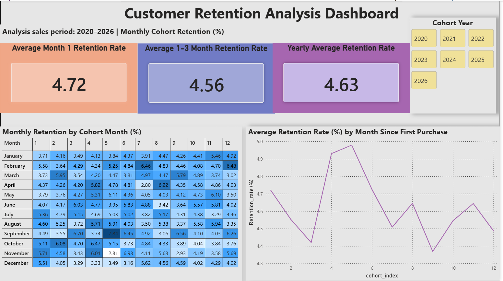
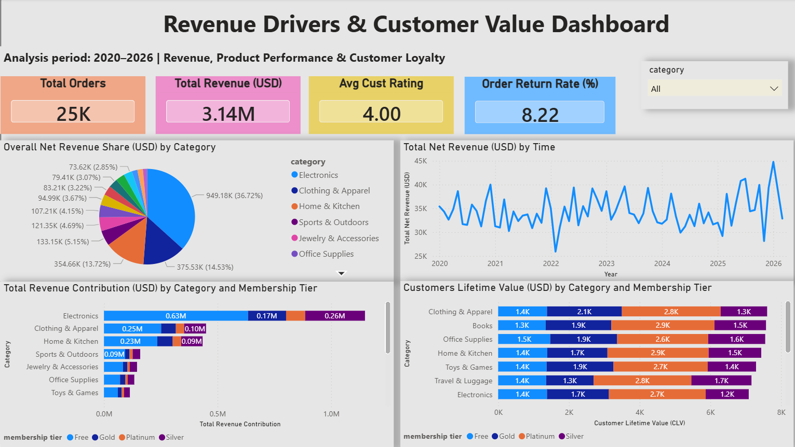
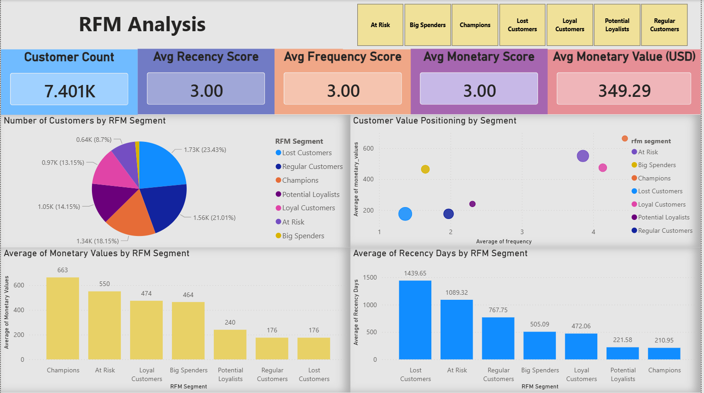

# E-Commerce Customer Behavior, Retention and Revenue Analysis (2020-2026)
## Project Overview
This project analyzes customer behavior, retention patterns, and revenue drivers in an e-commerce business from 2020 to 2026.

The objective is to transform raw transactional data into actionable insights across:
- Customer retention (Cohort Analysis)
- Revenue & product performance
- Customer segmentation (RFM Analysis)

The final deliverable is a set of interactive Power BI dashboards designed to support business decision-making.

## Business Question

This analysis aims to identify key gaps in customer retention, uncover high-value customer segments, and highlight revenue drivers to support data-driven decision-making.

- How quickly do customers churn after their first purchase, and where are the biggest retention drop-offs?

- Which customer segments (RFM-based) contribute the most to revenue, and which segments are at risk of churn?

- Which product categories drive the majority of revenue, and are they supported by strong customer retention?

- Are high-value customers concentrated in specific categories or membership tiers?

- Where should the business focus: improving early retention, reactivating at-risk customers, or expanding high-performing product segments?

## Dataset Description
This project uses an open-source dataset from Kaggle:

🔗 https://www.kaggle.com/datasets/meruvakodandasuraj/e-commerce-customer-behavior-and-sales-20202026/data

The dataset contains transactional and customer-level data for an e-commerce business from **2020 to 2026**, and is structured into two main tables:

---
### Customers Table

This table contains demographic and behavioral attributes for each customer.

**Key fields:**
- customer_id – Unique identifier for each customer
- country – Customer location
- age, gender – Demographic information
- membership_tier – Customer loyalty level (e.g., Free, Silver, Gold)
- preferred_category – Customer’s preferred product category
- acquisition_channel – Source of customer acquisition
- churned – Indicates whether the customer has churned

**Usage in analysis:**
- Customer segmentation (RFM)
- Customer profiling
- Membership tier and CLV analysis

---

### Orders Table

This table records all customer transactions.

**Key fields:**
- order_id – Unique order identifier
- customer_id – Links to Customers table
- order_date – Date of purchase
- total_amount_usd – Total order value
- order_status – Order completion status
- product_name – Product purchased
- category – Product category
- payment_method – Payment type
- device_used – Device used for purchase
- discount_amount_usd – Discount applied to the order

**Usage in analysis:**
- Cohort analysis (customer retention)
- Revenue and trend analysis
- Product and category performance
- RFM metrics (recency, frequency, monetary)

---
## Analytical Methods

This project uses SQL-based data transformation and Power BI visualization to analyze customer retention, revenue drivers, customer value, and customer segmentation.

The analysis is divided into four main methods:

1. Cohort Analysis  
2. Revenue & Product Performance Analysis  
3. Customer Lifetime Value (CLV) Analysis  
4. RFM Customer Segmentation  

---

## 1. Cohort Analysis — Customer Retention

Cohort analysis was used to evaluate how well customers return after their first purchase.

Customers were grouped based on their **first order month**, also known as the **cohort_month**. Each later purchase was assigned a **cohort_index**, which represents the number of months after the customer’s first purchase.

cohort_index = 0 → first purchase month

cohort_index = 1 → 1 month after first purchase

cohort_index = 2 → 2 months after first purchase

The retention rate was calculated as:
Retention Rate (%) = Active Customers in Month N / Customers in Cohort Month × 100

### Purpose
- Identify early churn patterns
- Understand how retention changes over time
- Compare retention performance across different customer cohorts
- Evaluate whether customers continue purchasing after their first order

### Dashboard Output 

The cohort analysis was visualized using:

- Monthly retention heatmap
- Retention trend line chart
- KPI cards for average retention performance for period first month, first three months and one year 

## 2. Revenue & Product Performance Analysis 

Revenue and product analysis was used to understand the commercial drivers behind customer behavior.

The analysis measured:

- Total revenue
- Total orders
- Revenue by product category
- Monthly revenue trend
- Top-performing product categories
- Order return rate
- Average customer rating

### Purpose
- Identify which product categories contribute the most revenue
- Understand revenue trends over time
- Evaluate whether revenue is concentrated in specific categories
- Compare product/category performance with customer behavior

### Dashboard Output 

The revenue and product analysis was visualized using:

- Revenue share by category
- Monthly revenue trend
- Revenue contribution by category and membership tier
- KPI cards for total revenue, total orders, average rating, and order return rate

## 3. Customer Lifetime Value (CLV) Analysis 

Customer Lifetime Value was used to estimate the value generated by customers across different membership tiers and product categories.

In this project, CLV was calculated using customer-level revenue contribution and customer count by segment.

CLV = Revenue Contribution / Number of Customers

### Purpose 
- Compare customer value across membership tiers
- Identify high-value customer groups
- Understand which customer groups contribute stronger long-term value
- Support loyalty and retention strategy decisions

### Dashboard Output
CLV was visualized using:

- Customer lifetime value by category
- Customer lifetime value by membership tier
- Revenue contribution by customer group

## 4. RFM Analysis — Customer Segmentation

RFM analysis was used to segment customers based on purchasing behavior.

RFM stands for:

#### Recency	
- Days since last purchase	
- How recently a customer purchased
#### Frequency
- Number of completed orders	
- How often a customer purchases
#### Monetary
- Total customer spend
- How much value a customer contributes

Each customer was scored from 1 to 5 for Recency, Frequency, and Monetary using quintile ranking.

NTILE(5) OVER (ORDER BY metric)

For Recency, lower values are better because recent customers are more active.
For Frequency and Monetary, higher values are better because they indicate stronger engagement and higher spending.

### RFM Segment Classification

Customers were grouped into business segments such as:

- Champions
- Loyal Customers
- Potential Loyalists
- At Risk
- Lost Customers
- Big Spenders
- Regular Customers

### Purpose
- Identify high-value customers
- Detect inactive or at-risk customers
- Understand customer behavior at segment level
- Support targeted marketing and reactivation strategies

### Dashboard Output

The RFM analysis was visualized using:

- Customer count by RFM segment
- Revenue contribution by RFM segment
- Customer value positioning scatter plot
- KPI cards for total customers, average recency score, average frequency score, average monetary score and average monetary value

## 5. Dashboard Storytelling Approach

The final Power BI report was designed as a three-page analytical story:

Page 1: Customer Retention Analysis
→ Are customers returning after their first purchase?

Page 2: Revenue Drivers & Customer Value Analysis
→ What categories, products, and customer groups drive business value?

Page 3: RFM Customer Segmentation
→ Which customer segments should the business prioritize?

This structure connects customer behavior, revenue performance, customer value, and customer targeting into one end-to-end analysis.

The overall analytical flow is:

Retention behavior
→ Revenue and product drivers
→ Customer value
→ Customer segmentation
→ Business recommendations

## Dashboard Overview

The final Power BI report consists of three dashboard pages. Each page focuses on a different stage of the customer analytics story: retention, revenue drivers, and customer segmentation.

---

### Page 1: Customer Retention Analysis

### Purpose:
To understand how customers return after their first purchase and identify early churn patterns.

### Key Visuals:
- Monthly cohort retention heatmap
- Retention rate trend line
- KPI cards:
  - Month 1 Retention
  - Average 1–3 Month Retention
  - Average 1–12 Month Retention
- Year slicer for cohort filtering

### Business Value:
This dashboard helps identify how quickly customers stop returning after their first purchase and which cohorts show stronger or weaker retention behavior.

---

### Page 2: Revenue Drivers & Customer Value Analysis

### Purpose:
To understand which product categories, membership tiers, and customer groups contribute most to business value.

### Key Visuals:
- Revenue share by product category
- Monthly net revenue trend
- Revenue contribution by category and membership tier
- Customer Lifetime Value by category and membership tier
- KPI cards:
  - Total Orders
  - Total Revenue
  - Average Customer Rating
  - Order Return Rate

### Business Value:
This dashboard connects sales performance with customer value, helping identify revenue concentration, high-performing categories, and valuable membership groups.

---

### Page 3: RFM Customer Segmentation

### Purpose: 
To segment customers based on purchasing behavior and identify which groups should be prioritized for retention, loyalty, or reactivation strategies.

### Key Visuals:
- Customer count by RFM segment
- Revenue contribution by RFM segment
- Customer value positioning scatter plot
- Average recency day by RFM segment
- KPI cards:
  - Total Customers
  - Average Recency Score
  - Average Frequency Score
  - Average Monetary Score
  - Average Monetary Value
- Slicers:
  - RFM Segment

### Business Value:
This dashboard helps translate customer behavior into actionable customer groups, such as Champions, Loyal Customers, At Risk customers, and Lost Customers.

---

## Dashboard Story Flow

The three dashboard pages are designed to follow a business decision-making flow:

Page 1: Retention Analysis
→ Are customers coming back?

Page 2: Revenue & Customer Value Analysis
→ Which products, categories, and customer groups drive business value?

Page 3: RFM Segmentation
→ Which customer groups should the business target?

## Key Insights

### Page 1: Customer Retention Analysis

The customer retention dashboard shows that overall retention remains relatively low across the 2020–2026 period.

Across all cohorts, the overall **Month 1 retention rate is 4.72%**, while the average retention rate across the first three months is **4.56%**. The overall average retention rate across the yearly cohort view is **4.63%**.

This indicates that only a small percentage of customers return after their first purchase, suggesting a clear early-stage retention challenge.

#### Key Observations

- **2025 shows the strongest retention performance**, with a Month 1 retention rate of **7.65%** and an average 1–3 month retention rate of **7.20%**. This suggests that the 2025 customer cohorts were more likely to return compared to earlier years.

- **2021 shows one of the weakest retention performances**, with Month 1 retention at **4.08%** and average 1–3 month retention at **3.90%**.

- **2023 has the lowest Month 1 retention rate at 3.40%**, suggesting weaker immediate repeat-purchase behavior for that cohort year.

- **2024 shows improvement in longer-term retention**, with a yearly average retention rate of **5.28%**, higher than 2020–2023.

- **2026 data appears incomplete**, as Month 1 retention is not available and only limited cohort months are shown. Therefore, 2026 should be interpreted cautiously.

#### Business Implication

The retention pattern suggests that the business should focus heavily on improving the customer experience within the first few months after purchase. Since Month 1 retention is generally below **5%** for most years except 2025, there is a strong opportunity to improve repeat purchases through:

- first-purchase follow-up campaigns
- personalized product recommendations
- loyalty incentives
- targeted promotions within the first 30–90 days

### Page 2: Revenue Drivers & Customer Value Analysis 

The revenue dashboard shows that the business generated **25K total orders** and **$3.14M total revenue** across the 2020–2026 analysis period. The overall average customer rating is **4.00**, while the order return rate is **8.22%**.

> Note: The KPI card for **Total Revenue** includes all order revenue, including returned items. The revenue share pie chart uses **net revenue from successfully delivered orders only**, so these figures serve different analytical purposes.

#### Category Revenue Contribution

Based on delivered net revenue, revenue is highly concentrated in a few key categories.

| Category | Net Revenue Share |
|---|---:|
| Electronics | 36.72% |
| Clothing & Apparel | 14.53% |
| Home & Kitchen | 13.72% |
| Sports & Outdoors | 5.15% |
| Jewelry & Accessories | 4.69% |
| Office Supplies | 4.15% |
| Toys & Games | 3.67% |
| Beauty & Personal Care | 3.22% |
| Books | 3.07% |
| Automotive | 2.85% |

**Electronics is the strongest revenue driver**, contributing **36.72%** of delivered net revenue, far ahead of the second-largest category, Clothing & Apparel at **14.53%**. This indicates that the business depends heavily on Electronics as its main revenue category.

#### Category-Level Performance

Selected category performance shows large differences in revenue contribution, order volume, and return rate:

| Category | Total Orders | Total Revenue | Avg Rating | Return Rate |
|---|---:|---:|---:|---:|
| Electronics | 5K | $1.15M | 3.98 | 8.04% |
| Clothing & Apparel | 4K | $449.29K | 4.02 | 7.28% |
| Home & Kitchen | 3K | $434.21K | 4.02 | 8.80% |
| Sports & Outdoors | 2K | $159.62K | 3.99 | 7.78% |
| Jewelry & Accessories | 973 | $145.63K | 3.98 | 7.81% |
| Office Supplies | 770 | $133.47K | 3.95 | 8.05% |
| Toys & Games | 2K | $114.06K | 4.04 | 8.37% |
| Beauty & Personal Care | 2K | $104.59K | 3.99 | 7.54% |
| Books | 2K | $96.01K | 4.01 | 8.26% |
| Automotive | 768 | $94.45K | 4.01 | 8.07% |
| Travel & Luggage | 521 | $91.71K | 4.04 | 9.21% |
| Food & Grocery | 1K | $59.12K | 4.01 | 8.56% |
| Health & Wellness | 1K | $60.23K | 4.02 | 7.96% |
| Pet Supplies | 751 | $45.07K | 3.92 | 9.32% |

#### Key Observations

- **Electronics is the dominant revenue category**, generating approximately **$1.15M** in total revenue and contributing **36.72%** of delivered net revenue. This makes it the key commercial driver of the business.

- **Clothing & Apparel and Home & Kitchen are the next strongest revenue categories**, generating **$449.29K** and **$434.21K** respectively. These two categories provide meaningful secondary revenue streams after Electronics.

- **Pet Supplies has the highest return rate at 9.32%**, despite having relatively low total revenue of **$45.07K**. This may indicate product satisfaction, quality, fulfillment, or expectation mismatch issues.

- **Travel & Luggage also shows a high return rate at 9.21%**, suggesting it may require further review despite generating **$91.71K** in revenue.

- **Beauty & Personal Care has the lowest return rate among the selected categories at 7.54%**, while maintaining an average rating of **3.99**. This suggests relatively stable customer satisfaction and lower return risk.

- **Average customer rating is relatively consistent across categories**, mostly around **3.9–4.0**, indicating that rating alone may not fully explain revenue or return differences.

#### Customer Value and Membership Tier Insights

The customer lifetime value chart shows that CLV differs across categories and membership tiers.

- **Platinum customers generally show strong CLV contribution across multiple categories**, often representing one of the largest CLV segments.
- In several categories, **Free and Silver members contribute meaningful revenue volume**, suggesting that lower-tier customers still represent a large opportunity for loyalty conversion.
- Electronics generates the highest revenue contribution overall, with large contributions from Free and Silver members, indicating an opportunity to move high-spending lower-tier customers into paid or premium loyalty tiers.

#### Business Implication

The business should protect and grow its strongest revenue categories, especially **Electronics**, while monitoring categories with higher return rates such as **Pet Supplies** and **Travel & Luggage**.

Recommended actions include:

- Prioritize inventory, marketing, and customer retention strategies around high-revenue categories such as Electronics, Clothing & Apparel, and Home & Kitchen.
- Investigate high-return categories to identify product quality, delivery, sizing, or expectation issues.
- Use membership-tier insights to convert high-value Free and Silver customers into higher loyalty tiers.
- Combine revenue contribution and CLV analysis to identify categories where customer loyalty programs may create the strongest long-term value.

### 📍 Page 3: RFM Customer Segmentation — Key Insights

The RFM analysis segments customers based on **Recency**, **Frequency**, and **Monetary Value** to identify high-value customers, loyal customers, inactive customers, and reactivation opportunities.

Across the full customer base, the dashboard shows:

| Metric | Value |
|---|---:|
| Total Customers | 7.401K |
| Avg Recency Score | 3.00 |
| Avg Frequency Score | 3.00 |
| Avg Monetary Score | 3.00 |
| Avg Monetary Value | $349.29 |

This indicates that the overall customer base is balanced across the RFM scoring distribution, which is expected because the scoring method uses quintile ranking.

---

#### RFM Segment Distribution

| RFM Segment | Customer Count | Share of Customers |
|---|---:|---:|
| Lost Customers | 1.73K | 23.43% |
| Regular Customers | 1.56K | 21.01% |
| Champions | 1.34K | 18.15% |
| Potential Loyalists | 1.05K | 14.15% |
| Loyal Customers | 0.97K | 13.15% |
| At Risk | 0.64K | 8.70% |
| Big Spenders | 0.11K | 1.42% |

The largest customer group is **Lost Customers**, representing **23.43%** of the customer base. This suggests that a meaningful portion of customers have not purchased recently and may require reactivation strategies.

---

#### Segment Value Comparison

| RFM Segment | Avg Monetary Value | Avg Recency Days |
|---|---:|---:|
| Champions | $663 | 210.95 days |
| At Risk | $550 | 1,089.32 days |
| Loyal Customers | $474 | 472.06 days |
| Big Spenders | $464 | 505.09 days |
| Potential Loyalists | $240 | 221.58 days |
| Regular Customers | $176 | 767.75 days |
| Lost Customers | $176 | 1,439.65 days |

#### Key Observations

- **Champions are the highest-value segment**, with an average monetary value of **$663** and the lowest average recency of **210.95 days**. This segment represents the most valuable and active customers.

- **At Risk customers have high average monetary value ($550)** but very high recency of **1,089.32 days**, meaning these customers previously spent significantly but have not purchased recently. This makes them a strong target for win-back campaigns.

- **Lost Customers are the largest segment**, representing **23.43%** of customers, with the highest average recency of **1,439.65 days** and low average monetary value of **$176**. This indicates a large inactive customer base.

- **Regular Customers also have low average monetary value ($176)** and relatively high recency of **767.75 days**, suggesting limited engagement and lower customer value.

- **Big Spenders have relatively high monetary value ($464)** but only represent **1.42%** of customers. Although small in size, this group may be valuable for premium offers or targeted upselling.

- **Potential Loyalists show low recency (221.58 days)** but relatively low monetary value (**$240**), suggesting they are still active but may need nurturing to increase purchase frequency and spending.

---

#### Business Implication

The RFM segmentation highlights three clear customer strategies:

1. **Retain Champions**
   - Champions are high-value and relatively recent customers.
   - They should be protected through loyalty rewards, exclusive offers, and personalized engagement.

2. **Reactivate At Risk Customers**
   - At Risk customers have high past spending but long inactivity.
   - They are strong candidates for win-back campaigns, personalized discounts, or targeted reminders.

3. **Nurture Potential Loyalists**
   - Potential Loyalists are relatively recent customers but have lower spending.
   - The business can encourage repeat purchases through product recommendations, membership benefits, and bundled promotions.

Overall, the RFM analysis shows that the business should not treat all customers equally. Marketing and retention strategies should be tailored by customer segment to maximize customer lifetime value and reduce churn risk.

## Business Recommendations

Based on the retention, revenue, customer value, and RFM analysis, the business should focus on improving early customer engagement, protecting high-value customers, and optimizing revenue-driving categories.

---

### 1️. Improve Early Customer Retention

The cohort analysis shows that Month 1 retention is relatively low, with overall Month 1 retention at **4.72%** and average 1–3 month retention at **4.56%**.

This suggests that many customers make a first purchase but do not return regularly.

**Recommended actions:**
- Send personalized follow-up offers after the first purchase
- Create first 30-day and 90-day retention campaigns
- Recommend products based on first purchase category
- Offer loyalty points or vouchers for second purchases

**Expected business impact:**
Improving early retention can increase repeat purchase behavior and strengthen long-term customer value.

---

### 2️. Protect and Grow High-Value Customer Segments

RFM analysis shows that **Champions** are the highest-value segment, with an average monetary value of **$663** and the lowest average recency of **210.95 days**.

These customers are highly valuable and should be retained proactively.

**Recommended actions:**
- Provide exclusive rewards for Champions
- Offer early access to promotions or new products
- Create VIP loyalty benefits
- Use personalized product recommendations

**Expected business impact:**
Protecting high-value customers can improve revenue stability and reduce the risk of losing the most profitable customer groups.

---

### 3️. Reactivate At Risk Customers

At Risk customers have a high average monetary value of **$550**, but their average recency is **1,089.32 days**, meaning they previously spent significantly but have not purchased recently.

This group represents a strong reactivation opportunity.

**Recommended actions:**
- Launch win-back campaigns for inactive high-value customers
- Offer limited-time discounts or personalized incentives
- Use email or remarketing campaigns based on past purchase behavior
- Highlight new arrivals or related products from their preferred categories

**Expected business impact:**
Reactivating At Risk customers can recover lost revenue from customers who have already shown strong spending potential.

---

### 4️. Optimize High-Revenue Product Categories

The revenue dashboard shows that **Electronics** is the strongest revenue driver, contributing **36.72%** of delivered net revenue and generating approximately **$1.15M** in total revenue.

**Recommended actions:**
- Prioritize inventory and marketing investment in Electronics
- Cross-sell accessories or complementary products
- Use Electronics as an anchor category for promotional campaigns
- Monitor return rate and customer satisfaction to protect category profitability

**Expected business impact:**
Focusing on high-performing categories can maximize revenue growth and improve marketing efficiency.

---

### 5️. Investigate High-Return Categories

Some categories show relatively high return rates, including **Pet Supplies (9.32%)** and **Travel & Luggage (9.21%)**.

High return rates may indicate product quality issues, unclear descriptions, customer expectation mismatch, or fulfillment problems.

**Recommended actions:**
- Review product descriptions and images
- Analyze return reasons if available
- Improve product quality checks
- Provide clearer sizing, specifications, or usage information
- Monitor suppliers or fulfillment performance

**Expected business impact:**
Reducing return rates can improve net revenue, customer satisfaction, and operational efficiency.

---

### 6️. Convert Lower-Tier Customers into Higher-Value Members

The customer value analysis shows that membership tiers contribute differently across categories. Free and Silver customers contribute meaningful revenue volume, while higher-tier customers show stronger customer lifetime value.

**Recommended actions:**
- Encourage Free and Silver customers to upgrade membership
- Offer tier-based loyalty rewards
- Provide targeted incentives for high-spending lower-tier customers
- Promote benefits such as free shipping, exclusive discounts, or early access

**Expected business impact:**
Improving membership tier conversion can increase customer loyalty and customer lifetime value.

---

## Overall Recommendation

The business should prioritize a customer lifecycle strategy that focuses on:

Acquire → Retain early → Grow value → Reactivate at-risk customers

## 🛠️ Tools Used

- **PostgreSQL** — SQL analysis and data transformation  
- **DBeaver** — SQL query execution  
- **Power BI** — Dashboard design and visualization  
- **Excel / CSV** — Data export and preparation  
- **GitHub** — Project documentation and portfolio hosting

## 📸 Dashboard Preview

### Page 1: Customer Retention Analysis

This dashboard analyzes customer retention using cohort analysis. It highlights Month 1 retention, short-term retention, yearly average retention, and monthly retention patterns by cohort.

---

### Page 2: Revenue Drivers & Customer Value Analysis

This dashboard analyzes revenue performance, product category contribution, customer lifetime value, return rate, and membership-tier revenue contribution.

---

### Page 3: RFM Customer Segmentation

This dashboard segments customers into RFM groups such as Champions, Loyal Customers, At Risk, Lost Customers, Big Spenders, and Regular Customers. It helps identify customer value, recency behavior, and reactivation opportunities.

## Conclusion

This project demonstrates an end-to-end customer analytics workflow, starting from raw e-commerce transaction data and transforming it into business-ready insights.

The analysis shows that the business faces an early customer retention challenge, while revenue is strongly driven by key categories such as Electronics. RFM segmentation further highlights the need to protect high-value customers, reactivate at-risk customers, and nurture potential loyalists.

Overall, the project shows how SQL and Power BI can be used together to support data-driven decisions across customer retention, revenue performance, and customer segmentation.

---

## 👤 Author

**Lau Xian Jin**  

